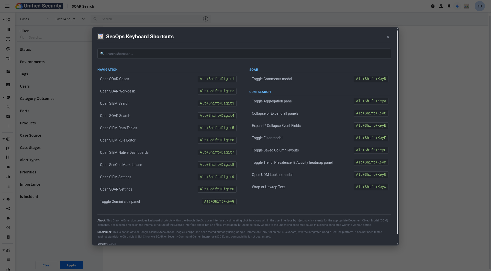

# Google SecOps Keyboard Shortcuts

An unofficial Chrome Extension that provides keyboard shortcuts and enhancements for the Google SecOps platform.

## Overview

This extension is designed for SecOps users who prefer keyboard-based navigation and interaction. It injects a content script into the Google SecOps web application to map keyboard combinations to common actions, such as navigating between pages (SOAR, UDM Search) and toggling UI panels. This eliminates the need for repetitive mouse clicks, streamlining workflows for power users.

A key feature is an on-demand, searchable modal that provides a quick reference for all available shortcuts.

## Features

- **Keyboard Shortcuts**: A rich set of `Alt+Shift+<Key>` shortcuts for navigation and UI interaction.
- **Shortcut Helper Modal**: Press `Alt+Shift+?` at any time to open a modal listing all available shortcuts.
- **Searchable List**: The shortcut modal includes a search bar to quickly find the command you need.
- **UI Integration**: Adds a convenient shortcut icon to the main SecOps header for easy mouse access.

## How to Use

1.  Once installed, navigate to your Google SecOps instance.
2.  Press `Alt+Shift+?` to open the shortcuts helper modal.
3.  Use the search bar to filter shortcuts.
4.  Use the key combinations as described below to perform actions.

## Available Shortcuts

### Navigation

| Shortcut | Description |
| :--- | :--- |
| `Alt+Shift+1` | Open SOAR Cases |
| `Alt+Shift+2` | Open SOAR Workdesk |
| `Alt+Shift+3` | Open SIEM Search |
| `Alt+Shift+4` | Open SOAR Search |
| `Alt+Shift+5` | Open SIEM Data Tables |
| `Alt+Shift+6` | Open SIEM Rule Editor |
| `Alt+Shift+7` | Open SIEM Native Dashboards |
| `Alt+Shift+8` | Open SecOps Marketplace |
| `Alt+Shift+9` | Open SIEM Settings |
| `Alt+Shift+0` | Open SOAR Settings |
| `Alt+Shift+G` | Toggle Gemini side panel |

### UDM Search

| Shortcut | Description |
| :--- | :--- |
| `Alt+Shift+A` | Toggle Aggregation panel |
| `Alt+Shift+C` | Collapse or Expand all panels |
| `Alt+Shift+E` | Expand / Collapse Event Fields |
| `Alt+Shift+F` | Toggle Filter modal |
| `Alt+Shift+L` | Toggle Saved Column layouts |
| `Alt+Shift+M` | Toggle Trend, Prevalence, & Activity heatmap panel |
| `Alt+Shift+U` | Open UDM Lookup modal |
| `Alt+Shift+W` | Wrap or Unwrap Text |

### SOAR

| Shortcut | Description |
| :--- | :--- |
| `Alt+Shift+N` | Toggle Comments modal |

## Installation

### For Development

1.  Clone or download this repository.
2.  Open Google Chrome and navigate to `chrome://extensions`.
3.  Enable "Developer mode" using the toggle in the top-right corner.
4.  Click the "Load unpacked" button.
5.  Select the directory where you cloned the repository.

## Disclaimer

This is not an official Google Cloud extension for Google SecOps. It has been tested primarily using Google Chrome on Linux, for an en-US keyboard, with the integrated Google SecOps platform. It has not been tested against standalone Chronicle SIEM, Chronicle SOAR, or Security Command Center Enterprise (SCCE), and compatibility is not guaranteed.

Because this extension relies on the internal structure of the SecOps interface, future updates by Google to the underlying code may cause this extension to stop working without notice.
