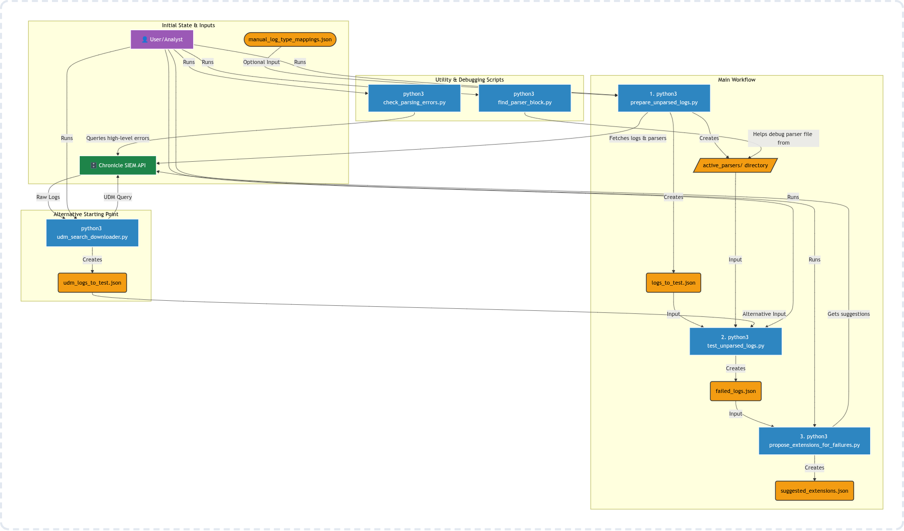

# Chronicle Parser Workflow Scripts

This directory contains a suite of Python scripts designed to help find, test, debug, and propose fixes for Chronicle parser configurations.

## Setup

### 1. Environment Configuration

Create a `.env` file in this directory (`parser_workflow`) with the following content, replacing the placeholder values with your Chronicle instance details:

```
PROJECT_ID="your-gcp-project-id"
REGION="your-chronicle-region" # e.g., us
INSTANCE_ID="your-chronicle-instance-id"
```

### 2. Python Virtual Environment & Dependencies

It is recommended to use a Python virtual environment.

```bash
# Create a virtual environment
python3 -m venv venv

# Activate the virtual environment
source venv/bin/activate

# Install the required Python packages
pip install -r requirements.txt
```

### 3. Authentication

These scripts use Google Application Default Credentials (ADC). Ensure you have authenticated with the gcloud CLI before running the scripts:

```bash
gcloud auth application-default login
```

## Main Workflow



The primary workflow involves three main scripts to identify unparsed logs, test them against parsers, and generate suggestions for failures.

### Step 1: Prepare Unparsed Logs

This script finds unparsed logs within a specified time range, downloads them, and also downloads all active parser files.

```bash
# Find unparsed logs from the last 24 hours and save them to logs_to_test.json
# This also creates the active_parsers/ directory with all current parsers.
python3 prepare_unparsed_logs.py
```
The output of this script is `logs_to_test.json` and the `active_parsers/` directory, which are used in the next step.

### Step 2: Test Logs Against Parsers

This script takes the logs from `logs_to_test.json` and runs them against the corresponding parser files in `active_parsers/` to identify which logs fail to parse.

```bash
# Test the logs and save any failures to failed_logs.json
python3 test_unparsed_logs.py
```
The output, `failed_logs.json`, contains only the logs that failed parsing, along with the specific error message.

### Step 3: Propose Parser Extensions for Failures

For logs that failed, this script uses the Chronicle Labs API to automatically generate a suggested parser extension to fix the parsing error.

```bash
# Use the default failed_logs.json as input
python3 propose_extensions_for_failures.py

# Or, specify a different input file
python3 propose_extensions_for_failures.py --input-file my_failed_logs.json
```
The output is `suggested_extensions.json`, which contains the API's suggestions for each log type.

## Utility Scripts

These scripts provide additional functionality for debugging and data collection.

### `find_parser_block.py`

Helps locate the exact block in a parser file that corresponds to a Chronicle error message. The index in the error is a global, zero-based count of all filters and control flow statements.

**Usage:**
```bash
# For an error like "filter mutate (50) failed"
python3 find_parser_block.py active_parsers/YOUR_PARSER.conf mutate 50

# To list all countable "nodes" in a parser to find the correct index
python3 find_parser_block.py active_parsers/YOUR_PARSER.conf --list-nodes
```

### `check_parsing_errors.py`

Queries Chronicle for a high-level summary of parsing errors over a specified time period.

**Usage:**
```bash
# Get errors from the last 7 days
python3 check_parsing_errors.py --past-days 7
```

### `udm_search_downloader.py`

Downloads the full raw logs for events found via a UDM query. The output is formatted to be directly usable as an input for `test_unparsed_logs.py`.

**Usage:**
```bash
# Download raw logs for UDM events matching a query and save to a file
python3 udm_search_downloader.py --query 'metadata.product_event_type = "user_login"' --output-file udm_logs_to_test.json
```

### `manual_log_type_mappings.json`

This file allows you to add manual mappings for log type display names that are not correctly returned by the API. If `prepare_unparsed_logs.py` reports a warning for an unknown display name, you can add the mapping here.
