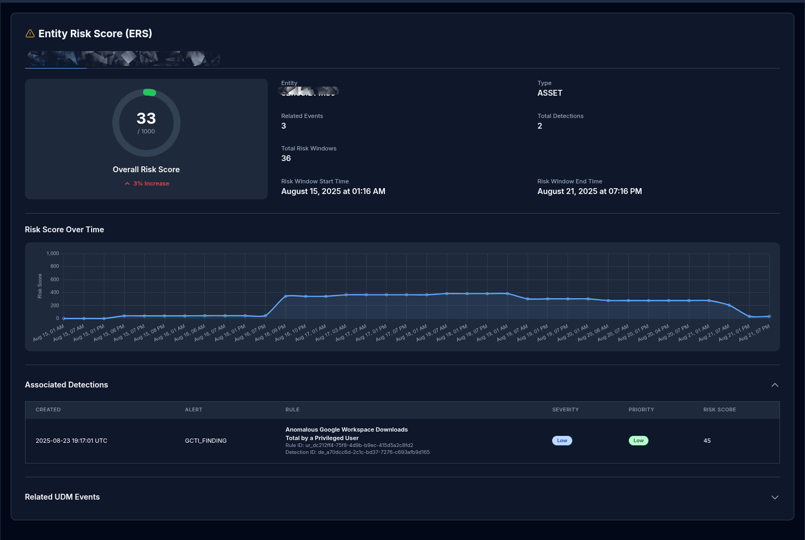

# Multi-Entity Risk Score Widget

## Overview

This HTML widget provides a comprehensive and visually intuitive dashboard for displaying Entity Risk Score (ERS) information within Google SecOps SOAR. It is designed to give security analysts a quick and detailed view of the risk associated with one or more entities (e.g., users, IP addresses, hosts).

The widget is dependent on the `SECOPS_RISK_ANALYTICS_TEMPLATE_BLOCK.zip` block in this repository, and uses Tailwind CSS for styling and Chart.js for data visualization.

## Features

- **Overall Risk Score:** Displays the current risk score in a prominent circular progress meter (from 0 to 1000).
- **Risk Trend Analysis:** Shows whether the risk score has increased or decreased over time, providing immediate context on the entity's recent behavior.
- **Historical Risk Chart:** Renders a line chart visualizing how the entity's risk score has changed over the risk window.
- **Tabbed Interface:** If data for multiple entities is provided, the widget automatically creates a tab for each one, allowing for easy navigation.
- **Associated Detections:** Lists the specific security detections (alerts) that are contributing to the entity's risk score, including details like rule name, severity, and priority.
- **Related UDM Events:** Provides a table of the underlying UDM (Unified Data Model) events that were used to calculate the risk scores.
- **Dynamic Theming:** The widget can automatically adapt to a light or dark theme based on messages received from its parent application, ensuring a seamless UI integration.

