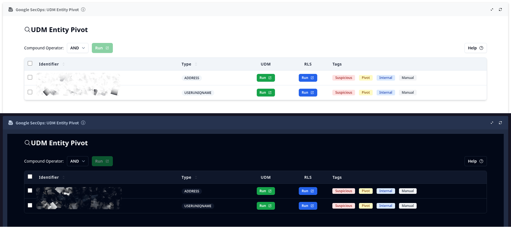

# UDM Entity Pivot Widget

This HTML widget provides a user interface for exploring and acting upon UDM (Unified Data Model) entities associated with a Google SecOps alert. It displays entities in a clear, sortable table and allows for quick pivoting to UDM and Raw Log Searches.

## How it Works

### Data

The widget is designed to receive entity data and render it in a table. The data is expected to be an array of JSON objects, where each object represents an entity and contains the following information:

*   `EntityCards.Identifier`: The entity's identifier (e.g., an IP address, domain name, or username).
*   `EntityCards.Type`: The type of the entity (e.g., `ADDRESS`, `DOMAIN`, `USERUNIQNAME`).
*   `EntityCards.IsInternalAsset`: A boolean indicating if the entity is an internal asset.
*   `EntityCards.IsPivot`: A boolean indicating if the entity is a pivot entity.
*   `EntityCards.IsSuspicious`: A boolean indicating if the entity is suspicious.
*   `EntityCards.IsManuallyCreated`: A boolean indicating if the entity was manually created.
*   `SourceSystemUrl`: The base URL for the Google SecOps instance.

### Theming

The widget supports both light and dark themes. It automatically detects the appropriate theme based on the background color of the parent application. This is achieved by listening for a `message` event and using the `isColorDark` function to determine whether to apply the light or dark theme.

### Features

*   **Entity Table**: Displays a list of entities with their identifier, type, and associated tags (Suspicious, Pivot, Internal, Manual).
*   **Sorting**: The table can be sorted by the "Identifier" and "Type" columns by clicking on the column headers.
*   **UDM and RLS Searches**: Each row has "Run" buttons that open a new browser tab to perform a UDM or Raw Log Search for that specific entity.
*   **Compound Search**: Users can select multiple entities using the checkboxes, choose a logical operator (`AND` or `OR`), and click the "Run" button to perform a combined UDM search.
*   **Help Modal**: A "Help" button opens a modal window that provides a brief explanation of the widget's features.

## How to Use

1.  **Integration**: Embed the `widget.html` file into your application.
2.  **Theming**: The widget will automatically adapt to the background color of the parent application.

