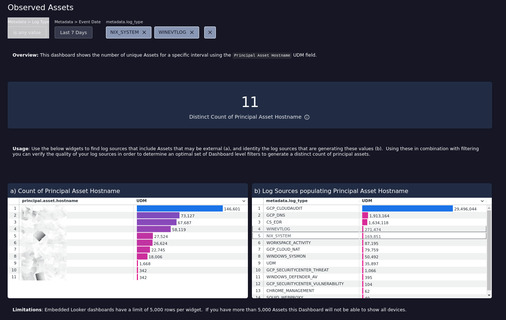

# Observed Assets

This Chronicle SIEM (Embedded Looker) Dashboard is designed to help verify assets observed in your environment using the principal.asset.hostname UDM field.

## Usage

Use widgets (a) and (b) to find log sources that include Assets that may be external (a), and identity the log sources that are generating these values (b).  Using these in combination with filtering you can verify the quality of your log sources in order to determine an optimal set of Dashboard level filters to generate a distinct count of principal assets.

Note, embedded Looker dashboards have a limit of 5,000 rows per widget.  If you have more than 5,000 Assets this Dashboard will not be able to show all devices.

__Note, this is not an official Google Cloud Chronicle Dashboard.__
