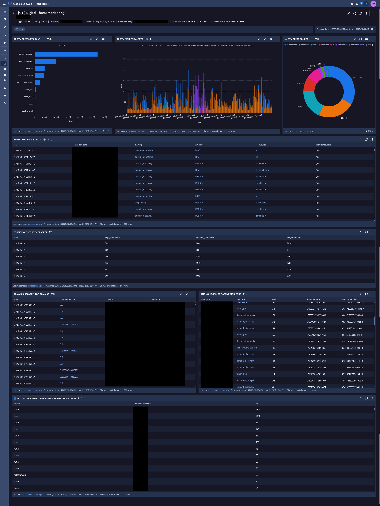

# GTI Digital Threat Monitoring
---
This repo contains an example integration between Google Threat Intelligence (GTI) and Google SecOps.  It uses a GCP Cloud Run Job to poll the DTM API and create UDM Events for your DTM Monitors.

## Contents
* Cloud Run Job
  * main.py
  * requirements.txt
  * Dockerfile

* SecOps (Native) Dashboard
  * GTI Digital Threat Monitoring.json

## Setup Intructions

